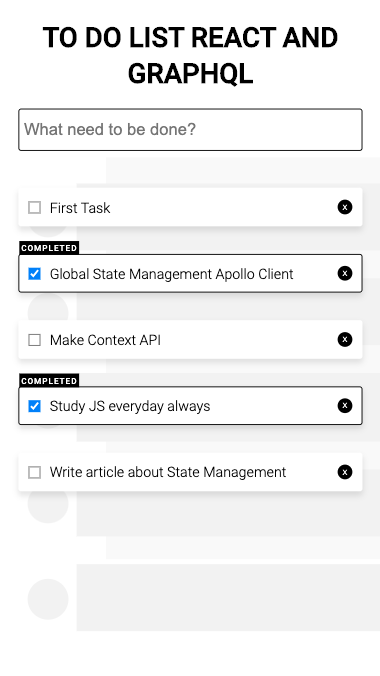

Todo React and GraphQL with Apollo Client 3

The project is study's Global State Management with Apollo Client 3

I don't used Context API or Redux to Global State Management

What is difference Redux, Context and Apollo Client

Redux

Storage: Plain JS object
- Updating state: actions + reducers
- Reactivity: Connect
- React Context + Hooks

Storage: Plain JS object
- Updating state: useReducer (or not)
- Reactivity: useContext
- Apollo Client

Storage: Normalized cache
- Updating state: Cache APIs
- Reactivity: (Auto) Broadcast change notifications to Queries

I got the information of Apollo Blog

[View Article](https://www.apollographql.com/blog/dispatch-this-using-apollo-client-3-as-a-state-management-solution/)

## Available Scripts

In the project directory, you can run:

### `yarn start`

Runs the app in the development mode. 
Open [http://localhost:3000](http://localhost:3000) to view it in the browser.

The page will reload if you make edits. 
You will also see any lint errors in the console.

### `yarn test`

### Shortscreen

